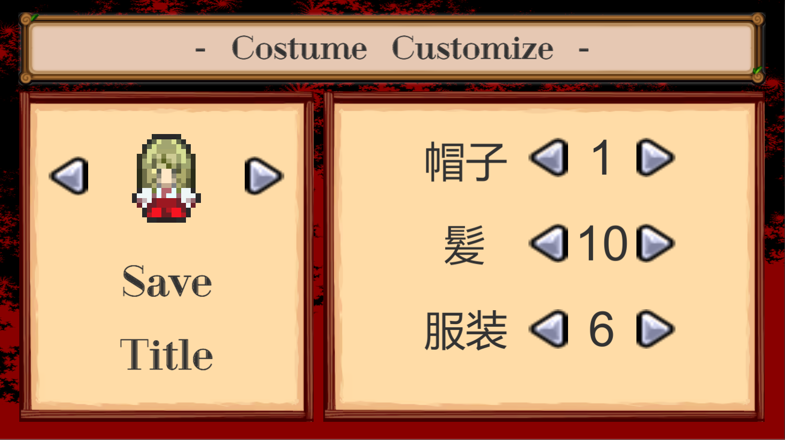

# Eternity Scapegoat
## 概要  
>ジャンル: トップダウンシューティング  
>制作人数: 1人  
>製作期間: 3.5ヶ月  
>制作時期: 1年次  
>>#### 開発環境
>>エンジン: Unity  
>>言語: C#  
>>ツール: Paint.net  
>>使用アセット: Unity Excel Importer Maker
>実行環境:  
>>OS: Windows 10  
>>RAM: 8GB  
>>GPU: Intel i5-8250U  
  
## ゲーム内容  
Call of Dutyシリーズに存在するゾンビモードを参考に作ったトップダウンシューティング。
敵を全滅させるとWaveが進み、次の敵が強くなって出てくるようになる。
マップには色々なオブジェクトがあり、例えば扉や武器やクリスタルパワーなど敵を倒すことでもらえる
お金で自身を強化していくことが出来る。
こうしてどこまでいけるかを競うサバイバルゲームである。  
  
## 開発目的  
この作品は学校に入って初めてのオリジナル作品でした。
Unity自体もこの時点では3ヵ月程しか触ってなかったが、その割には大分大掛かりな作品が出来たなと思っている。
もっともこの頃は自分が作りたいと思った作品を作ろうと頑張っていたため目標という目標はなかったが、
Unityに関する知識はこの作品で大分身に着いたと思っている。
  
## 頑張った点
- タイトルのUI
- NCMBを利用したオンラインランキング
- 現在の入力に応じた操作
- Excelを利用した武器やアイテムの管理
- キャラクターの外見変更
- Unity歴3ヵ月程でこれだけの物と作ったこと

## スクリーンショット
  

